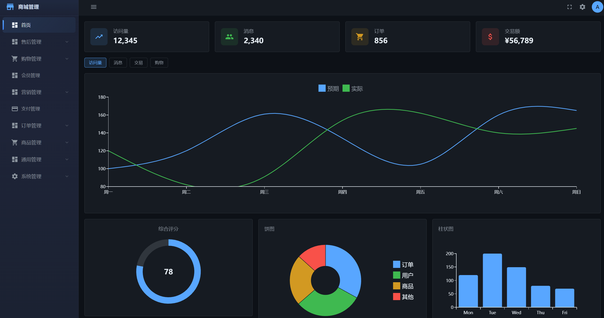
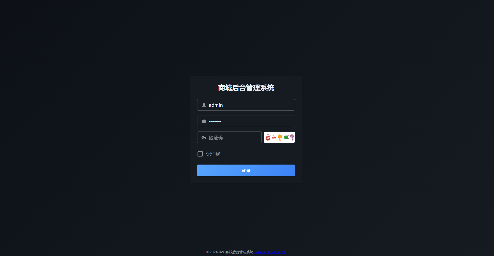

<div align="center">

# 商城后台管理系统

**React 18 + MUI v6 + Vite**

[](https://react.dev)
[](https://mui.com)
[](https://vitejs.dev)
[](https://zustand-demo.pmnd.rs)
[](https://reactrouter.com)

</div>

🔗 **后端仓库：[mall_server](https://github.com/yaocat55/mall_server)**

---


## 📸 效果预览

<div align="center">





</div>

## 🏪 业务简介

商城是一个综合型 B2C 电商平台的后台管理系统，覆盖电商运营全链路：

<table>
<tr>
<td width="25%"><b>🛒 商品管理</b></td>
<td>商品 CRUD、分类管理、属性/属性值、商品组、品牌、单位</td>
</tr>
<tr>
<td><b>📦 订单管理</b></td>
<td>订单查询、订单状态流转（下单→支付→完成→取消）、收货地址管理</td>
</tr>
<tr>
<td><b>🔄 售后管理</b></td>
<td>退货退款、换货处理、审核状态跟踪</td>
</tr>
<tr>
<td><b>🏷️ 营销管理</b></td>
<td>优惠券模板、用户领券/发券记录、秒杀活动</td>
</tr>
<tr>
<td><b>🛍️ 购物管理</b></td>
<td>购物车、商品评论、收藏、浏览记录、收货地址</td>
</tr>
<tr>
<td><b>👤 系统管理</b></td>
<td>用户/角色/菜单/部门/岗位/字典，RBAC 权限模型</td>
</tr>
<tr>
<td><b>📊 监控运维</b></td>
<td>Druid SQL 监控、在线用户、操作日志、定时任务</td>
</tr>
<tr>
<td><b>📢 通用功能</b></td>
<td>通知公告、验证码、文件上传、敏感词过滤、短信记录、行政区划</td>
</tr>
</table>

---

## 🛠 技术栈

<table>
<tr>
<td><b>框架</b></td>
<td>
  
  
</td>
</tr>
<tr>
<td><b>UI 组件库</b></td>
<td>
  
  
  
  
</td>
</tr>
<tr>
<td><b>路由</b></td>
<td>
  
</td>
</tr>
<tr>
<td><b>状态管理</b></td>
<td>
  
</td>
</tr>
<tr>
<td><b>HTTP</b></td>
<td>
  
</td>
</tr>
<tr>
<td><b>样式方案</b></td>
<td>
  
  
</td>
</tr>
<tr>
<td><b>工具库</b></td>
<td>
  dayjs · js-cookie · jsencrypt (RSA) · qs · screenfull · clipboard
</td>
</tr>
<tr>
<td><b>构建工具</b></td>
<td>
  
  
</td>
</tr>
</table>

---

## 🎨 UI 组件一览

本项目 100% 使用 MUI 官方组件，抛弃原生 HTML 元素：

<table>
<tr>
  <th>场景</th>
  <th>使用组件</th>
  <th>来源</th>
</tr>
<tr>
  <td>布局</td>
  <td><code>Box</code> <code>Grid</code> <code>Stack</code></td>
  <td>@mui/material</td>
</tr>
<tr>
  <td>表单</td>
  <td><code>TextField</code> <code>Switch</code> <code>Checkbox</code> <code>Select</code> <code>Radio</code></td>
  <td>@mui/material</td>
</tr>
<tr>
  <td>按钮</td>
  <td><code>Button</code> <code>IconButton</code> <code>Fab</code> <code>Chip</code></td>
  <td>@mui/material</td>
</tr>
<tr>
  <td>数据展示</td>
  <td><code>Table</code> <code>Card</code> <code>Typography</code> <code>Avatar</code> <code>Badge</code></td>
  <td>@mui/material</td>
</tr>
<tr>
  <td>反馈</td>
  <td><code>Dialog</code> <code>Snackbar</code> <code>Alert</code> <code>Tooltip</code></td>
  <td>@mui/material</td>
</tr>
<tr>
  <td>导航</td>
  <td><code>Drawer</code> <code>Menu</code> <code>Breadcrumbs</code> <code>AppBar</code> <code>List</code></td>
  <td>@mui/material</td>
</tr>
<tr>
  <td>图表</td>
  <td><code>LineChart</code> <code>BarChart</code> <code>PieChart</code> <code>Gauge</code></td>
  <td>@mui/x-charts</td>
</tr>
<tr>
  <td>日期选择</td>
  <td><code>DateTimePicker</code></td>
  <td>@mui/x-date-pickers</td>
</tr>
<tr>
  <td>图标</td>
  <td><code>Dashboard</code> <code>Store</code> <code>ShoppingCart</code> <code>People</code> 等</td>
  <td>@mui/icons-material</td>
</tr>
</table>

---

## 🚀 快速开始

```bash
# 安装依赖
npm install

# 启动开发服务器 (localhost:8013)
npm run dev

# 构建生产版本
npm run build

# 预览构建结果
npm run preview
```

> 开发环境通过 Vite proxy 将 `/api` 和 `/v1` 请求转发到后端 `http://localhost:8011`

---

## 📁 项目结构

```
mall_web/
├── public/                     # 静态资源
├── screenshots/                # 预览截图
├── src/
│   ├── api/                    # API 接口层 (axios 封装)
│   │   ├── aftersale/          #   售后 API
│   │   ├── common/             #   通用 API
│   │   ├── mall/               #   商品 API
│   │   ├── marketing/          #   营销 API
│   │   ├── order/              #   订单 API
│   │   ├── shopping/           #   购物 API
│   │   └── system/             #   系统 API
│   ├── assets/                 # 图片/字体等资源
│   ├── components/             # 公共组件
│   │   ├── Crud/               #   CRUD 通用组件
│   │   └── Layout/             #   布局组件
│   ├── hooks/                  # 自定义 Hooks
│   │   └── useCrud.js          #   CRUD 逻辑复用
│   ├── pages/                  # 页面组件
│   │   ├── aftersale/          #   售后管理
│   │   ├── common/             #   通用功能
│   │   ├── mall/               #   商品管理
│   │   ├── marketing/          #   营销管理
│   │   ├── monitor/            #   系统监控
│   │   ├── order/              #   订单管理
│   │   ├── shopping/           #   购物管理
│   │   ├── system/             #   系统管理
│   │   └── tools/              #   工具
│   ├── router/                 # 路由配置
│   ├── store/                  # Zustand 状态管理
│   ├── utils/                  # 工具函数
│   ├── App.jsx                 # 应用入口
│   └── main.jsx                # 挂载入口
├── package.json
├── vite.config.js
└── README.md
```

---

## ✨ 核心特性

- **全 MUI 组件体系** — 从按钮到图表、日期选择器，100% 使用 MUI 官方组件，零原生 HTML
- **深色主题** — GitHub Dark 风格配色，侧边栏渐变美学
- **动态路由** — 根据后端菜单接口自动生成路由和侧边栏
- **useCrud Hook** — 封装 CRUD 通用逻辑：分页、搜索、新增、编辑、删除、导出、时间范围查询
- **RSA 加密登录** — 前端 RSA 公钥加密密码传输
- **权限控制** — RBAC 角色-菜单权限，按钮级权限控制
- **响应式布局** — 移动端 Drawer 抽屉模式 + PC 端固定侧边栏
---

## 🎨 主题配色

<table>
<tr><td>页面背景</td><td><code>#0D1117</code></td></tr>
<tr><td>卡片/侧边栏</td><td><code>#1c2235 → #1e2438 → #1b2232</code> 渐变</td></tr>
<tr><td>导航栏</td><td><code>#161B22</code></td></tr>
<tr><td>输入框</td><td><code>#21262D</code></td></tr>
<tr><td>主色</td><td><code>#58A6FF → #3B82F6</code> 渐变</td></tr>
<tr><td>主文字</td><td><code>#E6EDF3</code></td></tr>
<tr><td>次要文字</td><td><code>#8B949E</code></td></tr>
</table>

---

<div align="center">
  <sub>Built with ❤️ using React + MUI + Vite</sub>
</div>
